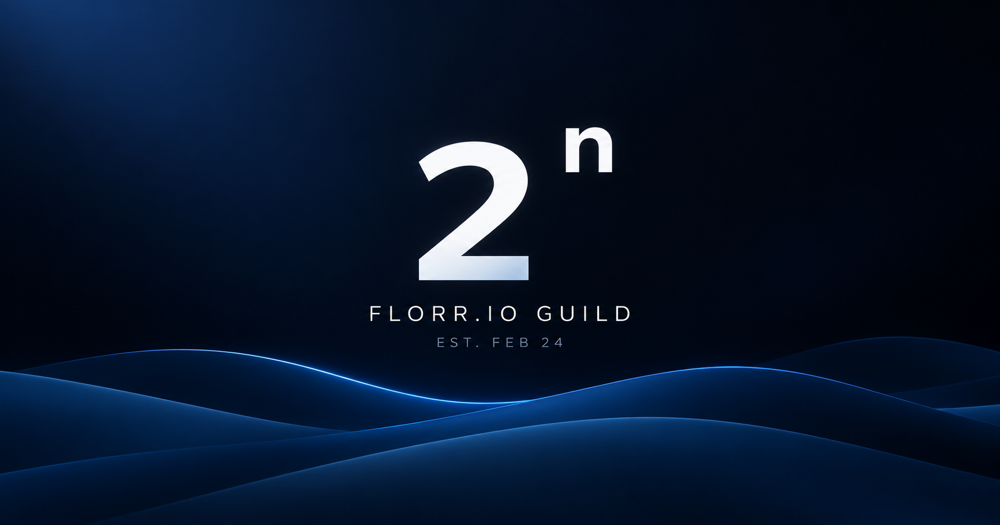

# 2n

2n 是围绕 Florr.io Guild 制作的互动纪念网站。它通过横向叙事、五生态场景、管理层介绍，以及成员液滴的汇聚、分裂与环绕，记录公会成员和一个阶段的故事。网站的重点是让场景与人物逐步进入视野，而不是把所有信息堆在同一页。

**在线网站：** https://llhleo.github.io/2n/

**当前稳定版本：** v1.0.3



## 项目概览

网站从序章进入五境，再把视角从游戏世界转向同行的人。管理层之后，成员名字成为液滴，逐渐汇聚成母液滴，随后分裂并进入环绕；半周年纪念、影片和最后的 2n 标识完成故事收束。这是一条可以前进、回看和反向浏览的互动故事，影片由访问者自行点击播放。

### 主要章节

- **序章 / Hero：** 中央的 2ⁿ 标识与三层五生态前景波浪共同建立开场；离开序章时，品牌视觉移向页眉。
- **五境 / Five Biomes：** 依次经过 Garden、Desert、Ocean、Jungle、Hell，保留项目所使用的 Florr.io 生态背景图与各自的颜色。
- **同行的力量 / Bridge：** 用短暂的叙事转折，把焦点从环境引向公会成员与管理层。
- **管理层 / Leaders：** 介绍管理成员的职位、姓名与贡献；该部分的常用文案集中在独立数据文件中。
- **成员汇聚 / Members：** 成员名字对应的小液滴靠近母液滴，通过连接、吸收与形变呈现汇聚。
- **分裂与环绕：** 母液滴分出小液滴，连接逐渐断开，随后过渡至环绕状态。
- **半周年、影片与结尾：** 冷色粒子与标题完成纪念段落；影片需手动播放，最后以安静的品牌画面结束。

## 视觉与交互

网站使用三种相互衔接的视觉空间：信息章节采用暖白背景、深色文字和较克制的编辑式排版；成员液滴与纪念等动画章节使用深蓝黑背景，以冷蓝液体和粒子作为视觉重点；五生态则保留原有生态图片和颜色。蓝色用于动画与少量强调，不是所有界面的统一底色。

触屏设备直接横向滑动浏览章节；桌面端延续纵向滚动推动横向故事的方式。2ⁿ 标识从序章中央移动至左上角，方便返回开场。成员章节的滚动进度驱动液滴汇聚、分裂和环绕，反向浏览时也能回到相应状态。普通阅读内容与动画段落因此有不同节奏，但属于同一条故事。

## 移动端与性能

项目针对 iPhone Safari 的滚动和绘制负担做过专门处理。Touch 路径让普通章节使用浏览器原生横向滚动；较重的开篇与成员动画只在相关章节需要时运行，并采用局部进度与按需调度的 `requestAnimationFrame`。设备路径主要根据指针与悬停能力区分，触屏宽设备不会单纯因为宽度大就被当作桌面。页面同时保留 reduced-motion 与基础内容回退。触屏旋转时按当前章节或管理层卡片及其内部进度恢复位置；开场在后台暂停，初始化成功后不再受启动超时计时器影响。

这些选择旨在减少普通浏览时持续的主线程工作，不承诺所有设备具有相同帧率。实际表现还会随浏览器合成方式、设备性能和系统设置而变化；调整动画时，尤其应重新检查触屏原生滚动和相关章节的生命周期。

## 技术与目录

站点使用 HTML、CSS 和原生 JavaScript；开篇地貌由 Canvas 绘制，成员液滴使用项目内的 SVG / Canvas 绘制路径。项目没有应用框架：`dist/` 是可直接预览的静态网站。发布时从它生成 `_site/`，仅将更小且解码像素完全一致的生态图片替换为无损 WebP，GitHub Pages 发布经过检查的 `_site/`。

```text
2n/
├─ dist/
│  ├─ index.html          # 页面结构与静态回退
│  ├─ app.js              # 章节编排与动画生命周期
│  ├─ world-scene.js      # 开场双层 Canvas 绘制
│  ├─ assets.js           # 图片加载与解码超时
│  ├─ motion.js           # 运动几何（含完整成员名单路径）
│  ├─ navigation.js       # 章节目标、相邻停靠点与触屏旋转锚点
│  ├─ liquid.js           # 液滴运动与几何
│  ├─ leaders-data.js     # 管理层文案
│  ├─ style.css           # 按原级联顺序合并的布局、触屏、动效与视觉样式
│  └─ assets/             # 生态图片、影片和分享图
├─ tools/                 # 本地预览、检查与测试
├─ package.json
├─ RELEASE-v1.0.md
└─ README.md
```

生态背景图片位于 `dist/assets/`；半周年影片是 `dist/assets/half-year.mp4`，分享封面是 `dist/assets/og-2n.png`。`tools/` 只用于本地预览与验证，不参与线上页面的运行。

## 本地预览与检查

在仓库根目录使用已安装的 Node.js 运行以下实际命令：

```sh
npm run dev
npm run check
npm test
```

`npm run dev` 启动项目自带的本地预览服务，按终端给出的地址打开网站；`npm run check` 验证静态资源、脚本与内容结构，`npm test` 运行运动、液滴、图片加载、内容同步、章节导航和触屏时间线测试。修改页面后建议先完成两项检查，再通过浏览器查看实际表现。也可以查看 `dist/index.html` 的静态结构，但交互检查应以本地预览服务为准。

### 可选：本地生成发布副本

日常预览仍使用 `npm run dev`，无需 Python。若要检查发布后的无损图片压缩结果，使用 Python 3.12 执行：

```sh
python -m pip install Pillow==11.3.0
python tools/optimize-assets.py
SITE_DIR=_site npm run check
```

脚本会重新生成 `_site/`，输出每张生态图片及合计节省的字节数。原始 `dist/` 不会被改写；视频仍按需加载。部署只接受像素一致且体积更小的 WebP，其他图片继续使用 PNG。

### 浏览器回归检查

CI 使用与测试包版本一致的 Playwright 预装镜像，对优化后的发布副本执行浏览器测试，避免每次重新安装浏览器系统依赖。本地安装测试工具后也可以运行：

```sh
npm install --no-save --package-lock=false @playwright/test@1.56.1
npx playwright install chromium webkit
npm run test:browser
```

默认预览 `dist/`；设置 `SITE_DIR=_site` 可验证发布副本。CI 还启动上一轮分支的对照站点，比较五个章节的计算样式。浏览器检查还覆盖成员动画回看、窄屏/横屏、旋转后的阅读位置、模拟的 visibilitychange/pageshow 事件，以及通过调试帧计数验证影片章节停止调度、开场继续播放。模拟后台事件和浏览器时钟不等同于真实系统挂起或浏览器 BFCache 恢复；触屏 WebKit 也不能替代 iPhone 真机的滚动、合成与帧率检查。触屏的 `maximum-scale=1, user-scalable=no` 和 Safari 手势拦截继续保留。

## 内容维护

### 管理层

管理层标题、开头说明、职位、姓名与个人贡献，正常情况下只需编辑 [`dist/leaders-data.js`](dist/leaders-data.js)。`intro` 保存引导文字；`people` 按展示顺序保存每张卡片。常用字段包括 `number`（编号）、`role`（中文职位）、`roleEn`（英文职位）、`name`（姓名）和 `description`（贡献说明）。修改后运行 `npm run content`，自动同步 `dist/index.html`，再运行检查并在预览中确认卡片数量、顺序与换行。

`dist/leaders-data.js` 是管理层内容的唯一编辑来源，`npm run content` 将它生成到 `dist/index.html`。有无 JavaScript 都读取同一份生成内容，浏览器不再重新创建管理层卡片。检查会拒绝数据与 HTML 不同步的提交，不必手动维护两份文案。生态文案、成员名单和纪念文案目前仍分散在页面结构或相关脚本中，没有统一的内容管理系统，修改前请先定位对应来源。

## 发布流程

从最新 `main` 新建工作分支，完成修改后运行 `npm run check` 和 `npm test`，再创建到 `main` 的 PR。合并前应检查受影响章节，涉及触屏滚动、品牌遮挡、液滴或性能时还应进行真机检查；核心动画与性能架构的改动应在独立分支验证，不直接提交到 `main`。

PR 会通过 GitHub Actions 运行 `npm run check`、`npm test`，并检查图片优化后的部署副本。此外，桌面 Chromium、触屏 Chromium 和触屏 WebKit 会验证开场跳过、章节导航、无脚本回退、沙漠配色及触屏缩放限制，并与上一轮分支比较主要章节的计算样式；检查失败则不会部署。PR 合并进入 `main` 后，同一工作流会将经过检查的 `_site/` 部署到 GitHub Pages。发布时注意 HTML 中 CSS / JS 的缓存参数是否与目标版本一致，部署后再核对线上页面；不需要手动生成部署文件。本轮优化说明见 [RELEASE-v1.0.3.md](RELEASE-v1.0.3.md)，最初发布记录见 [RELEASE-v1.0.md](RELEASE-v1.0.md)。

### 优化预览

当前维护分支的审阅入口为 https://llhleo.github.io/2n/preview/ 。仅指定的同仓库维护分支 PR 在静态、单元和浏览器检查通过后发布此路径。预览发布会从当前 `main` 重新生成正式发布副本，放在根路径；待审阅副本放在 `preview/`。两者均使用已校验的无损图片优化，避免预览发布使正式页面退回原始 PNG。发布前核对 `main` 未变化，发布后核对正式与预览的 HTML、CSS、所有脚本和五境图片内容。

预览是临时入口；后续正常的 `main` 发布会替换整个 Pages 站点，可能移除 `preview/`。正式地址始终是 https://llhleo.github.io/2n/ 。

正式发布通过线上文件核验后，CI 会清理已完整包含在该发布提交中的 `optimize/`、`maintenance/` 和 `fix/` 分支；受保护、含未合并提交或清理期间发生更新的分支保留。

## 项目状态

当前稳定版本为 **v1.0.3**。项目重点关注 iPhone Safari、移动端 Chromium 以及桌面 Chromium / Safari 等使用场景；不同设备和浏览器的合成、滚动行为可能略有差异。后续修改以保持现有内容可访问、移动端原生滚动顺畅和各章节动画连续为优先。

---

## Behind the Project

2n v1.0 不是一次生成出来的。从早期页面原型、五境和 Hero，到成员液滴的汇聚、分裂与环绕，再到触屏原生横向滚动、iPhone Safari 的性能和前景合成问题，期间经历了反复调试、真机反馈与发布前检查。这里既有开发者的设计决定和实际测试，也有 ChatGPT / GPT 辅助的代码开发。

| 项目 | 截至 v1.0.0 发布（2026-09-12） |
| --- | --- |
| 正式版本 | v1.0.0 |
| main 中的 Git 提交 | 85 个（统计至发布合并提交 `bdd38d6`） |
| Pull requests | 2 个，均已合并 |
| 可核实的开发历程 | Git 提交中出现早期 v3 等原型、v39～v42 阶段及最终 v1.0.0；这些名称不等于正式发布次数 |
| ChatGPT 账户累计 Token | 67,847,000 |
| 近一个月 Codex / Work 轮次 | 113 轮 |
| 账户记录的最长任务 | 48 分钟 |

ChatGPT 数字来自开发者在 v1.0 收尾阶段提供的**账户统计页面**；累计 Token、最近轮次和任务时长都是账户口径，**不是 2n 单项目消耗或项目独立统计**。该页面另显示峰值令牌数 30,408,000，含义同样按原账户页面记录，不推断为单次或本项目用量。

这里面有不少代码、很多次滚动测试、一堆液滴，以及比预想中更多的调试。
